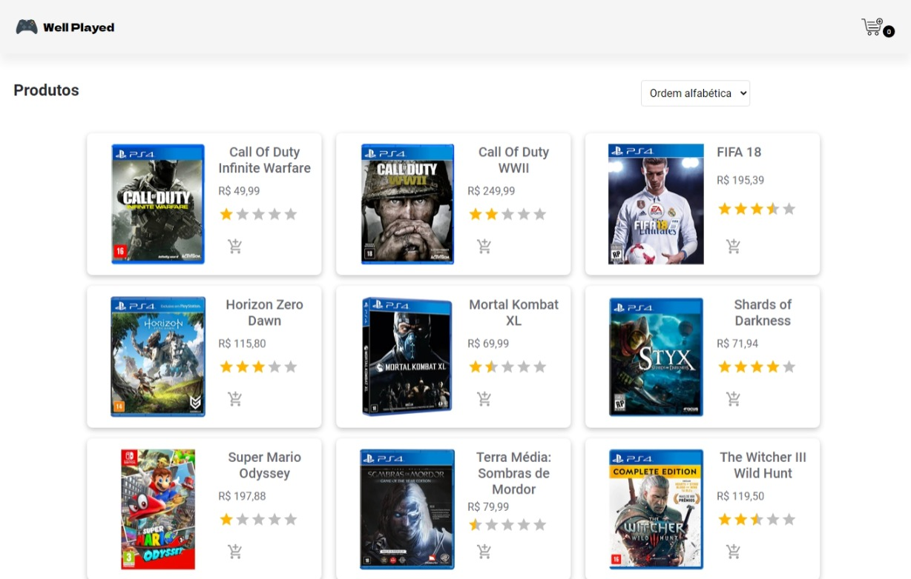

<h1 align="center">
    
    Well Played
</h1>

<p align="center">
  <a href="#-sobre">Sobre</a>&nbsp;&nbsp;&nbsp;|&nbsp;&nbsp;&nbsp;
  <a href="#-tecnologias">Tecnologias</a>&nbsp;&nbsp;&nbsp;|&nbsp;&nbsp;&nbsp;
  <a href="#-layout">Funcionalidades</a>&nbsp;&nbsp;&nbsp;|&nbsp;&nbsp;&nbsp;
  <a href="#-como-executar-o-projeto">Como executar</a>&nbsp;&nbsp;&nbsp;|&nbsp;&nbsp;&nbsp;
  <a href="#-licença">Licença</a>
</p>

<p align="center">
  

  
	
  
  <a href="https://github.com/pedromiiguel/projeto-react-supera/commits/master">
    
  </a>

  
   <a href="https://github.com/pedromiiguel/projeto-react-supera/stargazers">
    
  </a>
</p>


<br/>

<h1 align="center">
    
</h1>

## 🔖 Sobre

O Well Played é um e-commerce de jogos para video games, desenvolvido durante um desafio técnico para uma vaga na emrpesa Supera Tecnolgia. 

## 🚀 Tecnologias

Tecnologias utilizazadas no projeto:

- [SASS](https://sass-lang.com/)
- [React](https://pt-br.reactjs.org/)
- [Javascript](https://developer.mozilla.org/pt-BR/docs/Web/JavaScript)
- [HTML](https://developer.mozilla.org/pt-BR/docs/Web/HTML)
- [CSS](https://developer.mozilla.org/pt-BR/docs/Web/CSS)

## 🛠 Funcionalidades e requisitos

 - Ordenar produtos de acordo com as categorias (preço, popularidade e ordem alfabética);
 - Adicionar produtos ao carrinho;
 - Remover produtos do carrinho;
 - A cada produto adicionado ao carrinho soma-se R$ 10.00 de frete;
 - Compras acima de R$ 250.00 o valor de frete é grátis;

## 🔧 Como executar o projeto

### Pré-requisitos

<p> É necessário possuir o Node.js instalado na máquina </p>
<p>E também possuir um gerenciador de tarefas NPM ou Yarn.</p>

```bash
# Clone este repositório
$ git clone https://github.com/pedromiiguel/projeto-react-supera

# Acesse a pasta do projeto no terminal/cmd
$ cd projeto-react-supera

# Instale as dependências
$ npm install ou yarn

# Execute a fake api
$ npm server ou yarn server

# Execute a aplicação em modo de desenvolvimento
$ npm start ou yarn start

# O servidor inciará na porta:3000 - acesse http://localhost:3000 
```

## 📝 Licença

Esse projeto está sob a licença MIT.

## :man_astronaut: Autor

#### Pedro Miguel

- Git Hub: <a href="https://github.com/pedromiiguel" target='_blanck' >@pedromiiguel</a>
- Linkedin: <a href="https://www.linkedin.com/in/pedro-miiguel" target='_blanck' >@pedromiiguel</a>
